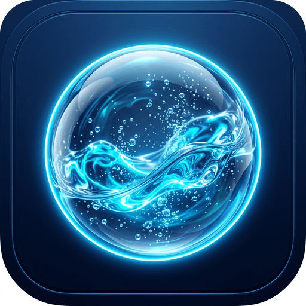

# 💧 Drink Up - Smart Hydration Tracker & Reminder App

<div align="center">



### Stay Healthy, Stay Energised, Stay Hydrated! 🌊

[](https://github.com/SINGH0883/Drink-Up)
[](https://capacitorjs.com)
[](https://react.dev)
[](https://www.typescriptlang.org/)
[](https://tailwindcss.com/)
[](https://vitejs.dev/)
[](LICENSE)

[📥 **Download Android APK (< 5 MB)**](https://github.com/SINGH0883/Drink-Up/raw/main/drink-up.apk)

</div>

---

## 📱 About Drink Up

**Drink Up** is a smart, modern hydration companion designed to help you build and maintain healthy daily drinking habits. Built with **React 19**, **Tailwind CSS**, and **Capacitor 7**, Drink Up offers fluid animations, personalized hydration targets, intelligent reminders, voice alerts, and detailed hydration analytics — packaged in an ultra-optimized **< 5 MB Android APK**.

---

## ✨ Key Features

### 🌊 1. Interactive Dual-Color Hydration Ring
- **Dual Meter Gauge**: Green arc for completed intake and Red arc for remaining goal.
- **Hydration Animation Orb**: Embedded water animation with dynamic rising liquid level.
- **Micro-Bubbles & Splash Effects**: Visual and haptic feedback with floating volume increments (+250ml) whenever water is logged.
- **Celebration Confetti**: Dynamic confetti explosion when reaching your daily hydration goal.

### 📊 2. Real-Time Status Bar
- **Slim Two-Tone Progress Strip**: Placed conveniently between quick log buttons and the navigation bar.
- Shows live amount consumed (with completion percentage) vs remaining milliliters at a single glance.

### 👋 3. Dynamic 3D Greeting Header
- **3D Animated Waving Hand**: Welcoming greeting with time-of-day contextual messages (*Good morning*, *Good afternoon*, *Good evening*).
- **Streak & Reminders Shortcut**: Direct access to your consecutive streak counter and alarm manager.

### 🎯 4. Personalized Smart Goal Calculator
- Calculates optimal daily intake based on:
  - Weight & Body Metrics
  - Activity Level (Sedentary, Moderate, Active)
  - Climate & Weather (Normal, Warm, Hot)
  - Biological Factors & Custom overrides

### ⚡ 5. Quick-Add & Custom Logging
- One-tap quick add buttons with custom presets (150ml, 250ml, 500ml).
- Custom volume selector for exact amounts.
- Floating **Undo Toast** to instantly revert accidental entries.

### ⏰ 6. Smart Reminders, Voice Alerts & In-App Banners
- **Interval Reminders**: Automatically schedule alerts every 30m, 1h, 1.5h, 2h, or 3h.
- **Custom Time Slots**: Set exact daily alarm times.
- **Wake & Sleep Smart Hours**: Prevents notifications during your sleep cycle.
- **Multi-Modal Alert Styles**:
  - 🗣️ **Text-to-Speech (Voice)**: Speaks motivational hydration reminders.
  - 🔔 **Sound Beep**: Gentle acoustic notification chime.
  - 📳 **Haptic Vibration**: Discreet tactile alerts.
  - 📲 **In-App Toast Banner**: Direct top banner alert with sound on in-app reminder events.

### 📈 7. Comprehensive Analytics & Streak Tracking
- **Weekly Trend Charts**: Interactive bar graphs highlighting daily goal attainment.
- **Drink Breakdown**: Chronological log with timestamps and volumes.
- **Streak Tracker**: Tracks consecutive days of hitting your goal to keep you motivated.

### 🎨 8. Premium UI & Performance Optimization
- **Ultra Lightweight**: ProGuard & R8 resource shrinking keeps the full release APK at **~4.78 MB** (< 5 MB).
- **Theme Modes**: Seamless Light and Dark mode support.
- **Units**: Supports both Metric (`ml`) and Imperial (`fl oz`).

---

## 📲 Download & Install APK

You can download the pre-built Android APK directly from this repository:

👉 **[Download `drink-up.apk` (4.78 MB)](https://github.com/SINGH0883/Drink-Up/raw/main/drink-up.apk)**

### Installation Steps on Android:
1. Download `drink-up.apk` onto your Android smartphone.
2. Tap the downloaded file to install.
3. If prompted, allow *"Install from unknown sources"*.
4. Launch **Drink Up** and start tracking your hydration!

---

## 🛠️ Tech Stack & Architecture

- **Frontend**: [React 19](https://react.dev/), [TypeScript](https://www.typescriptlang.org/), [Vite](https://vitejs.dev/)
- **Styling**: [Tailwind CSS](https://tailwindcss.com/), CSS3 Wave Animations, Glassmorphism
- **Icons**: [Lucide React](https://lucide.dev/)
- **Cross-Platform / Native Bridge**: [Capacitor 7](https://capacitorjs.com/)
  - `@capacitor/local-notifications` - Native scheduled background alerts
  - `@capacitor/haptics` - Native tactile feedback
  - `@capacitor-community/text-to-speech` - Voice notification prompts
  - `@capacitor/status-bar` & `@capacitor/splash-screen` - Native OS styling
  - `@capacitor/preferences` - Persistent offline storage
- **Effects**: [canvas-confetti](https://www.npmjs.com/package/canvas-confetti)

---

## 📂 Project Structure

```
Drink-Up/
├── android/                   # Native Android Capacitor project
├── public/                    # Static assets & icons
│   ├── logo.png
│   ├── hydrate-bg.webp
│   └── circle-water.gif
├── src/
│   ├── components/            # UI components
│   │   ├── common/            # Header, Navigation, Modal wrappers
│   │   ├── history/           # Charts and analytics components
│   │   ├── home/              # WaterRing, QuickAddButtons, CustomAddModal
│   │   ├── onboarding/        # Goal setup wizards
│   │   ├── reminders/         # Notification schedules & time pickers
│   │   └── settings/          # Unit toggles, themes, user preferences
│   ├── hooks/                 # Custom React hooks (useHydration, useReminders)
│   ├── lib/                   # Native wrappers (audio, haptics, notifications, storage)
│   ├── pages/                 # Main app views (Home, History, Reminders, Settings)
│   ├── styles/                # Tailwind & custom CSS animations
│   ├── types/                 # TypeScript interfaces and type definitions
│   ├── App.tsx                # App root & navigation router
│   └── main.tsx               # Entry point
├── drink-up.apk               # Pre-built ready-to-install Android APK (< 5 MB)
├── package.json
├── tailwind.config.js
└── vite.config.ts
```

---

## 📄 License

This project is licensed under the [MIT License](LICENSE).

---

<div align="center">
  Made with 💙 by <b>SINGH0883</b>
</div>
